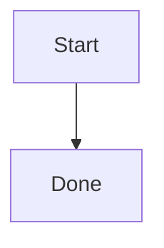

# Markdown Support

## Obsidian Images

Supported:

```markdown
![[diagram.png]]
![[diagram.png|Architecture diagram]]

```

Resolution order:

1. absolute path
2. path relative to the source Markdown file
3. path relative to configured `vault_root`
4. filename search inside `vault_root`

Non-image Obsidian embeds are rejected with an actionable error.

## Wiki Links

Non-image wiki links are converted to visible text:

```markdown
[[Target Note|Alias]] -> Alias
[[Target Note]] -> Target Note
```

## Callouts

Obsidian callouts are converted by `assets/filters/obsidian-callouts.lua` into Typst callout blocks.

```markdown
> [!warning] Deployment risk
> Keep a rollback path.
```

## Mermaid

Mermaid fences are rendered to SVG before Pandoc when `render_mermaid = true`.

```markdown

```

The renderer sets both root `htmlLabels: false` and `flowchart.htmlLabels: false` so Typst keeps labels visible.

Use `--no-render-mermaid` when `npx` is unavailable or when source code output is desired.

## Page Breaks

Use comments for explicit weak page breaks:

```markdown
<!-- pdf: pagebreak -->
<!-- pdf: section-break -->
```

`--section-breaks h1`, `h2`, or `h2-major` can add automatic weak page breaks before selected headings.

## Tables

Markdown pipe tables are normalized before Pandoc:

- numeric and financial columns align right;
- rows starting with `Total`, `Cout`, `Coût`, or `Budget` are emphasized;
- escaped pipes and inline code pipes are preserved.
